<!-- hero: monochrome ASCII portrait (types in) beside the extruded 3d ascii
     wordmark (wipes in left-to-right, then rocks on its vertical axis).
     widths are picked so both panels land at the same height.
     portrait: python scripts/prep_photo_simple.py && python scripts/make_ascii_svg.py
     wordmark: python scripts/make_wordmark_svg.py --mode rock -->

<h3><code>mangesh@github ~ $ whoami</code></h3>

<table>
<tr>
<td valign="top"></td>
<td valign="top"></td>
</tr>
</table>

 
 

<!-- animated contribution graph: real data, boxes reveal cell by cell
     (regenerated daily by .github/workflows/update-profile-art.yml) -->

<h3><code>mangesh@github ~ $ ./contributions.sh</code></h3>

 
 

<h3><code>mangesh@github ~ $ ./links.sh</code></h3>

<b>AI Software Engineer · LLM · GenAI · Agents</b>

 

---

  

  <h3>Building production LLM apps, AI agents & GenAI products used by 2000+ global users</h3>

  

    
    
    
  

  

    
    
    
    
    
  

---

### About Me

- AI Software Engineer focused on **LLM applications, RAG, GenAI & AI agents**
- ~1 year shipping production AI products used by **2000+ users worldwide**
- Built **7 Chrome extensions** with **2500+ installs** across US, UK, Germany, Japan & India
- National Hackathon Finalist — **IIT-BHU Technex '25 (Top 12 / 1000+ teams)**
- Currently working on **Ethical Sentiment Big Data Pipeline**
- Open to **remote AI Software Engineer roles** (US / UK / Canada startups & SaaS)

---

### Experience Snapshot

| Role | Company | Highlights |
|---|---|---|
| **AI Engineer & Frontend Developer** | BlockseBlock | Built **PeacePulse AI** — production LLM + RAG, React UI, shipped in **45 days** |
| **Software Developer — AI Applications** | The ProEducator | Production **AI Agent** for natural-language MongoDB queries; **60% faster** retrieval |
| **AI/ML Engineer** | InternPe | Shipped 3 end-to-end ML/DL projects (TensorFlow, Streamlit, MLOps) |

---

### Featured Projects

- **PeacePulse AI** — GenAI + RAG platform with prompt chaining & React UI
- **AI Chat Agent** — NL → MongoDB queries with LLM fallback (Node + React)
- **Personal Loan ML Pipeline** — Scikit-learn Decision Tree · 87% accuracy · +40% targeting
- **Claude Enhancer** — Chrome GenAI productivity extension
- **Job Fit Check** — AI resume-to-job matching extension

---

### Tech Stack

#### AI / GenAI

  
  
  
  
  
  

#### ML / Data

  
  
  
  
  
  

#### Full-Stack

  
  
  
  
  
  

#### Tools

  
  
  
  
  

---

### Achievements

- Top 12 National Finalist — **IIT-BHU Technex '25** (1000+ teams)
- Top 50 — **Smart India Hackathon (SIH) Campus Edition 2024**
- **IBM Machine Learning & Cloud Certification 2025**
- International Campus Ambassador — **IMUNA New York 2024**
- **7 published Chrome extensions · 2500+ installs**

---

### Education

**B.Tech Computer Science Engineering**  
Vishwakarma University, Pune · Graduating 2027 · CGPA **8.1**

---

  
    
  
    
  

